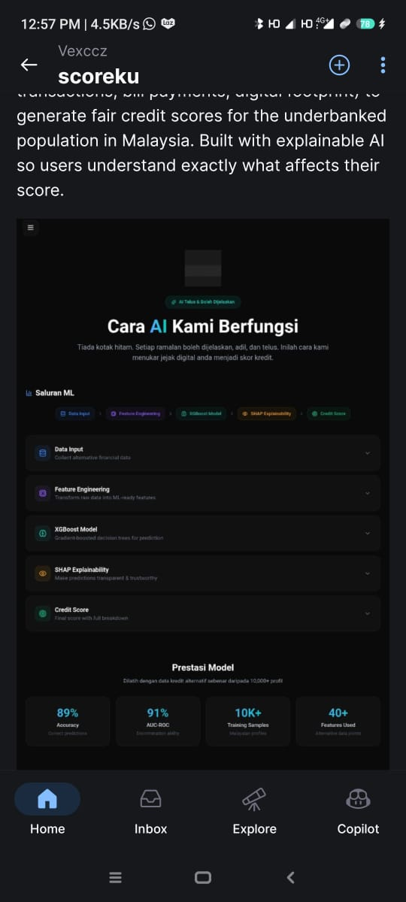

<div align="center">

# ScoreKu

**Alternative Credit Scoring for the Underbanked**

AI-powered credit scoring platform that uses alternative data sources to assess creditworthiness for Malaysians without traditional bank history.

[](LICENSE)
[](https://react.dev)
[](https://nodejs.org)
[](https://mongodb.com)
[](https://xgboost.ai)

[Live Demo](https://frontend-kappa-six-83.vercel.app) · [Report Issue](https://github.com/Vexccz/scoreku/issues) · [Request Feature](https://github.com/Vexccz/scoreku/issues)

</div>

---



## The Problem

An estimated 3.5 million Malaysians are excluded from traditional credit systems because they lack bank loans, credit cards, or formal financial history. This includes gig workers, fresh graduates, micro-entrepreneurs, and rural communities.

## The Solution

ScoreKu evaluates creditworthiness using alternative signals people already generate every day: e-wallet transactions, utility bill payments, e-commerce activity, and employment patterns. Every score comes with SHAP-based explanations so users understand exactly what drives their rating and how to improve.

## Core Features

- Alternative data scoring based on e-wallet, bills, and digital footprint
- Explainable AI with SHAP values showing feature contributions
- CTOS-aligned score range (300-850) for Malaysian context
- Personalized improvement recommendations
- Score history tracking and monthly reports
- Bilingual support (Bahasa Malaysia and English)
- Financial Literacy Hub with 8 structured articles
- Social sharing and referral system

## Tech Stack

| Layer        | Technologies                                                    |
| ------------ | --------------------------------------------------------------- |
| Frontend     | React 19, Vite, TailwindCSS, Framer Motion, Recharts            |
| Backend      | Node.js, Express, MongoDB, JWT                                  |
| ML Pipeline  | Python, XGBoost, SHAP, scikit-learn                             |
| Deployment   | Vercel (frontend), Render (backend)                             |
| Dataset      | 10,000 synthetic Malaysian credit profiles                      |

## Model Performance

| Metric     | Value  |
| ---------- | ------ |
| Accuracy   | 89.1%  |
| AUC-ROC    | 91.4%  |
| Precision  | 68.0%  |
| Recall     | 51.7%  |

## Project Structure

```
scoreku/
├── frontend/          React SPA (Vite + Tailwind)
│   ├── src/pages/     Landing, Dashboard, Score, Learn, Profile
│   ├── src/context/   Auth, Theme, Language, Offline
│   └── src/services/  API client
├── backend/           Express API server
│   ├── controllers/   Auth, Score logic
│   ├── models/        User, ScoreResult (Mongoose)
│   └── routes/        API endpoints
├── ml-model/          Python ML pipeline
│   ├── train_model.py Training script
│   ├── predict.py     Inference API
│   └── model.joblib   Trained XGBoost model
└── data/              Raw synthetic dataset
```

## Getting Started

### Prerequisites

- Node.js 18 or newer
- Python 3.10 or newer
- MongoDB (local or Atlas)

### Backend

```bash
cd backend
npm install
cp .env.example .env      # configure MONGO_URI and JWT_SECRET
node server.js
```

### ML Model

```bash
cd ml-model
pip install -r requirements.txt
python train_model.py
```

### Frontend

```bash
cd frontend
npm install
npm run dev
```

Open `http://localhost:5173` to view the app.

## How It Works

1. User completes a multi-step form with alternative data (employment, digital transactions, bill history)
2. Backend sends data to the Python ML service for inference
3. XGBoost model returns a score plus SHAP values for each feature
4. Frontend renders the score, risk category, feature impact breakdown, and actionable improvement tips

## Roadmap

- Bank API integration for real transaction data
- Mobile app with Capacitor (Android APK built, awaiting JDK 21)
- Integration with Malaysian credit bureaus
- Multi-language expansion beyond BM and EN

## License

Distributed under the MIT License. See `LICENSE` for details.
